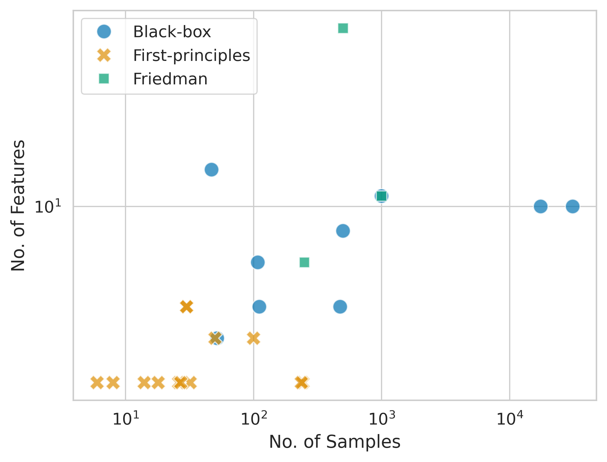
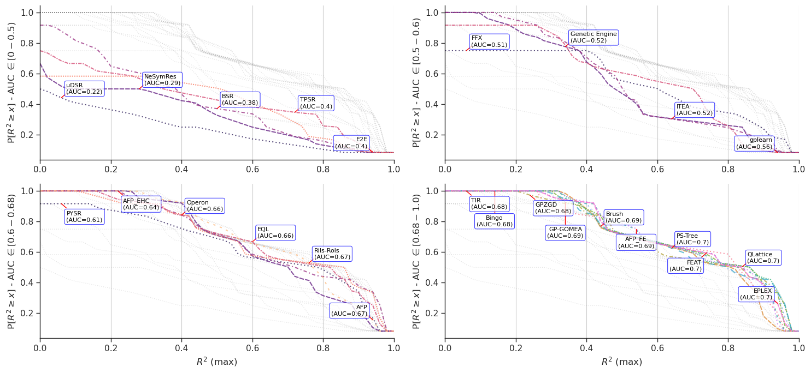
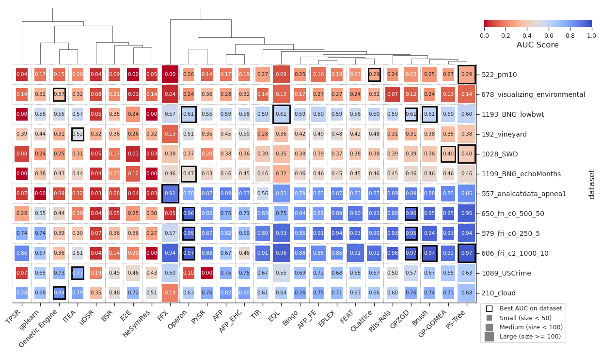
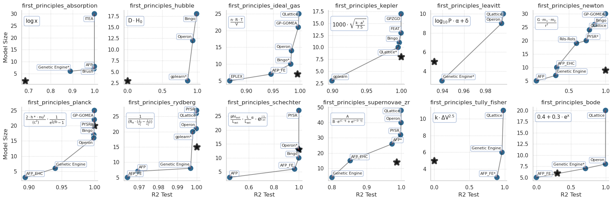

# Benchmarking Results

This page summarizes the results of the postprocessing notebooks found in this folder. 

Results are summarized over datasets. 

## Problems

We analyze two types of problems:

**Black-box Regression Problems**: problems for which the ground-truth model is not known/ not sought. 
Includes a mix of real-world and synthetic datasets from [PMLB](https://epistasislab.github.io/pmlb'). 
12 total. 

**First-principles Problems**: problems for which the ground-truth model is known and derived by first-principles analysis. 
Includes real-world and synthetic datasets from the [Multiview SR paper repository](https://github.com/erusseil/MvSR-analysis) and the [PySR paper repository](https://github.com/MilesCranmer/PySR). 
12 total. 

# Results for Black-box Regression

## Performance plots

We adopt _performance profile plots_ that describes the empirical distribution of the obtained results.
This plot illustrates the probability of achieving a performance greater than or equal to a given $R^2$ threshold for all possible thresholds.
In this plot, the $x$-axis represents a threshold value of the $R^2$ and the $y$-axis the percentage of runs that a particular algorithm obtained that value or higher.
This plot can give a broader view of the likelihood of successfully achieving a high accuracy for each algorithm, while keeping all the information for each algorithm in the same plot. 

## Performance-Complexity Trade-offs

The area under the curve (AUC) of the performance of an algorithm is a reasonable aggregation measure such that a value of $1.0$ means that all $30$ runs achieved maximum accuracy and an area of $0.0$ means it failed to find something above a baseline. 

We consider the trade-off between AUC and sizes of models simultaneously, this figure illustrates the trade-offs made by each method. 
Methods with small squares and bluish colors produce models with better trade-offs between performance and simplicity. 

# Results for Ground-truth Problems

How the best final solution of a method is symbolically equivalent to the ground-truth process.

